# Rawinnipa Brand Book

> Complete brand system for **Rawinnipa Software and Consultants** — strategy, identity, corporate collateral, and marketing imagery, all in one repository.
>
> **Version** 1.0 · **Issued** April 2026 · [rawinsoft.com](https://rawinsoft.com)

---

<p align="center">
  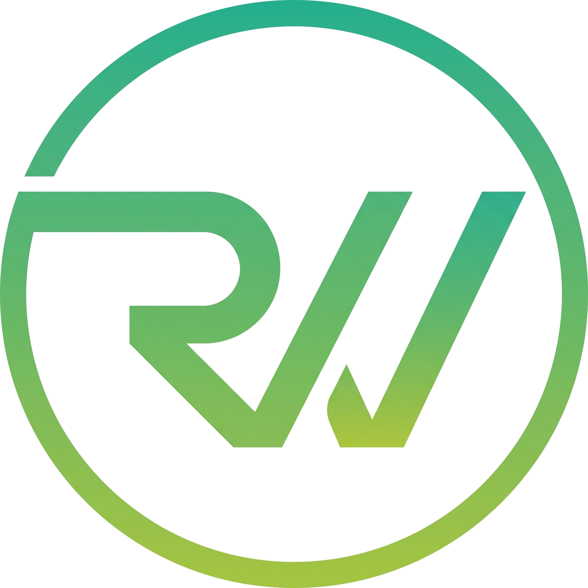
</p>

<p align="center">
  <b>Build what moves.</b><br/>
  <sub>Software and consulting partners, Bangkok. Est. 2014.</sub>
</p>

---

## 📁 Structure

```
brand-book/
├── 01-strategy/         Brand foundation, guidelines, design tokens
├── 02-logo/             Logo variants (transparent background)
├── 03-corporate/        Company profile & executive CV
├── 04-key-visuals/      Hero imagery for web & social
├── 05-uniforms/         Uniform design deck, spec sheet & mockups
├── 06-templates/        Editable slide & social PPTX templates
├── 07-stationery/       Business card, envelope, letterhead, invoice, quotation
├── 08-merch/            Branded merch mockups & sticker sheet
└── scripts/             Source scripts — every asset is parametric
```

---

## 🎨 Brand snapshot

### Primary palette

| | Name | Hex | RGB |
|---|---|---|---|
|  | **Rawin Green** *(primary)* | `#3EDC81` | 62, 220, 129 |
|  | Deep Teal | `#23B591` | 35, 181, 145 |
|  | Lime Accent | `#9DC351` | 157, 195, 81 |
|  | Deep Black | `#0A0A0A` | 10, 10, 10 |

Full palette, neutrals, and Pantone equivalents in [`01-strategy/Rawinnipa_Brand_Guidelines_v1.0.md`](01-strategy/Rawinnipa_Brand_Guidelines_v1.0.md#4-color-palette).

### Typography

- **Primary** — Inter (Bold / Semibold / Regular)
- **Thai pairing** — Noto Sans Thai
- **Office fallback** — Calibri

### Logo variants

<p align="center">
  &nbsp;&nbsp;
  &nbsp;&nbsp;
  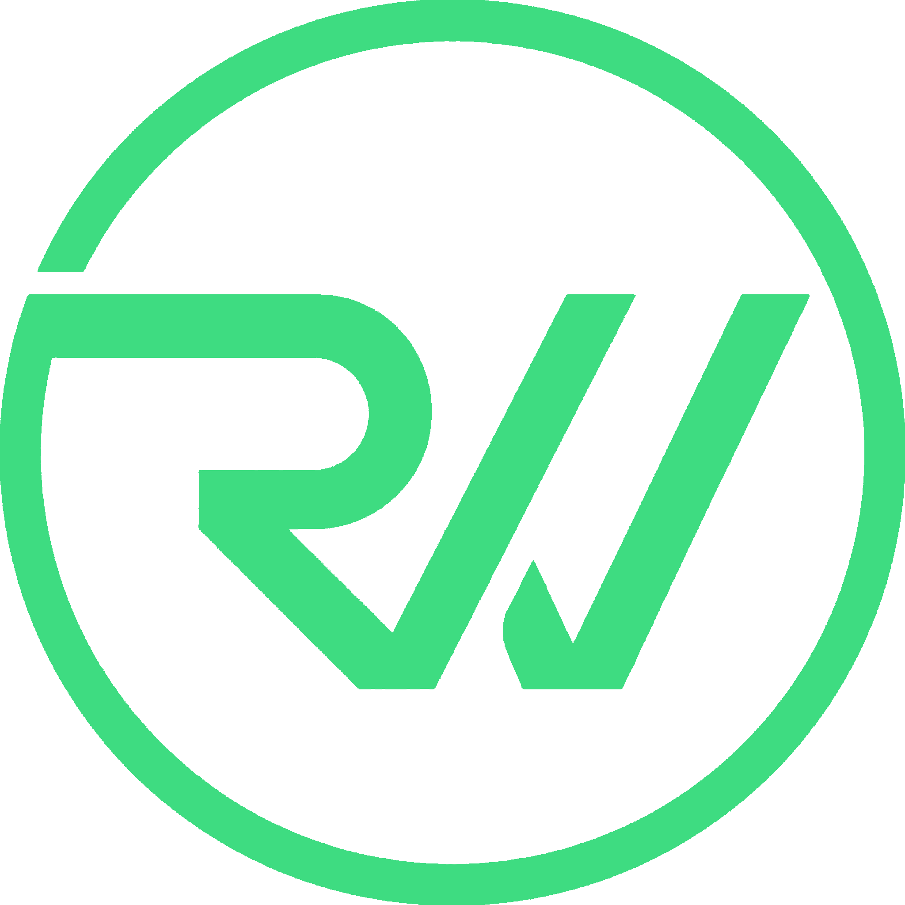&nbsp;&nbsp;
  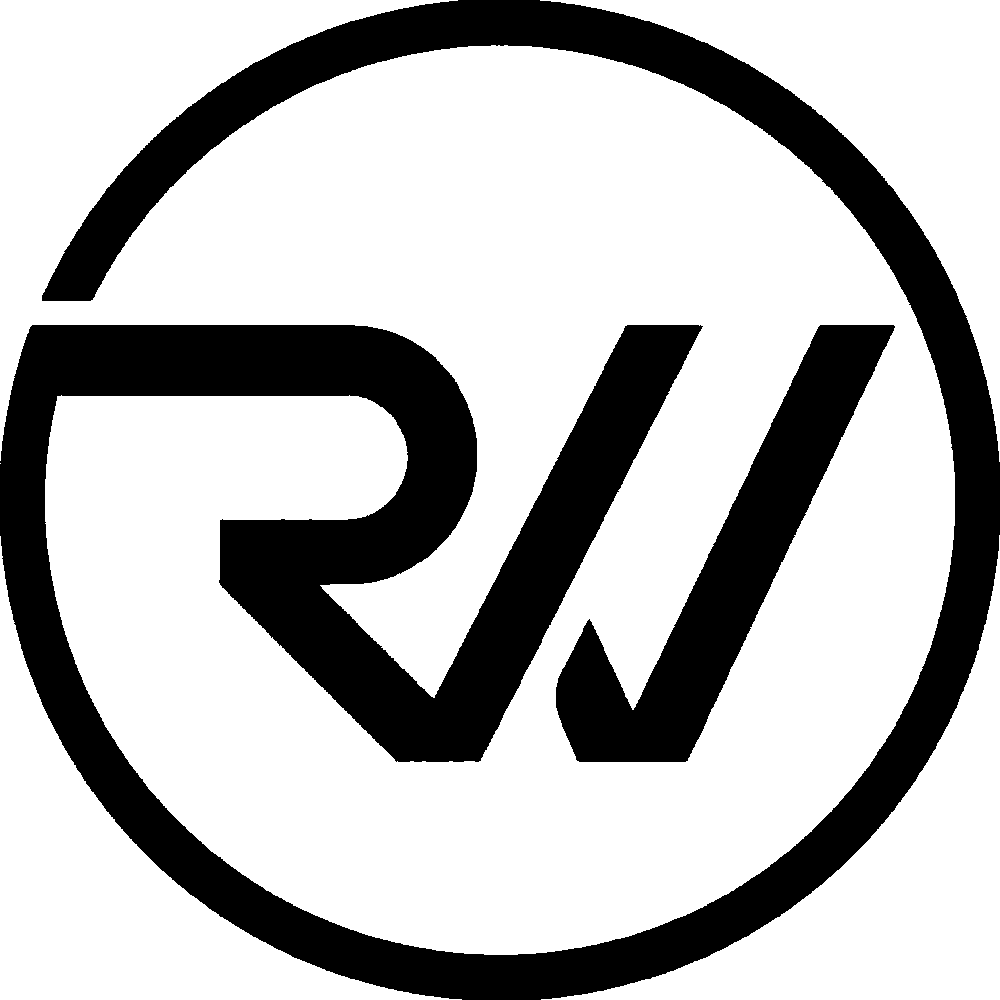
</p>

---

## 🖼️ Key Visuals preview

### Hero (English)
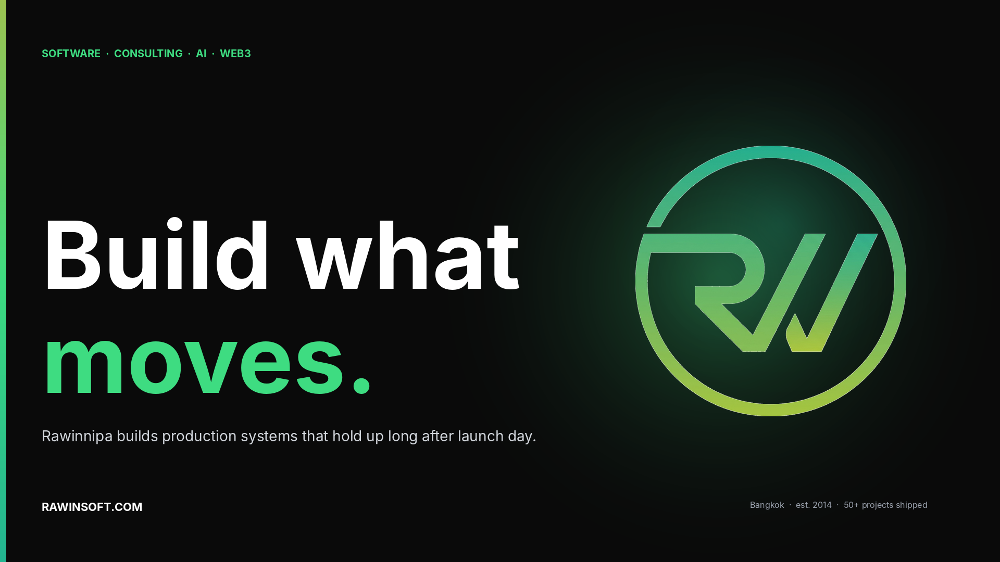

### Hero (Thai)
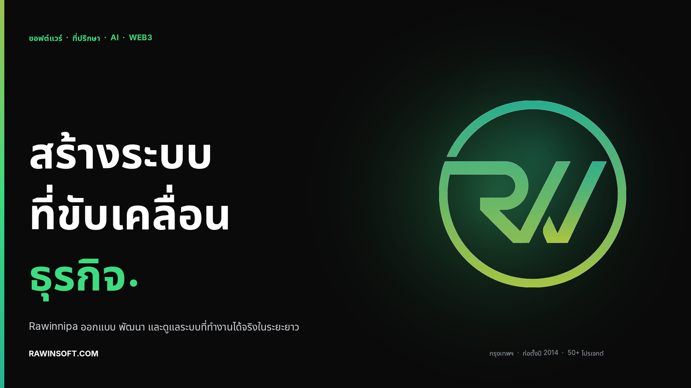

### Social formats

| Format | Preview |
|---|---|
| LinkedIn Banner — `1584 × 396` | 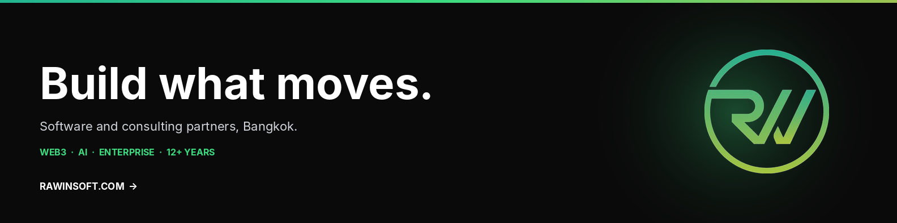 |
| Twitter / X Banner — `1500 × 500` | 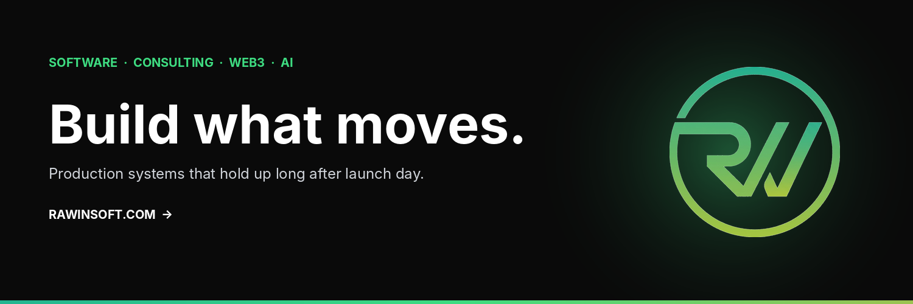 |
| Facebook Cover — `1640 × 624` | 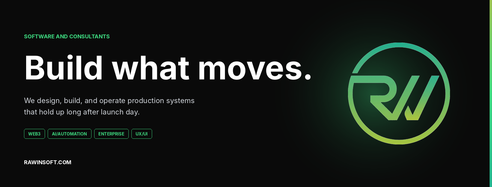 |
| Email Header — `1200 × 400` | 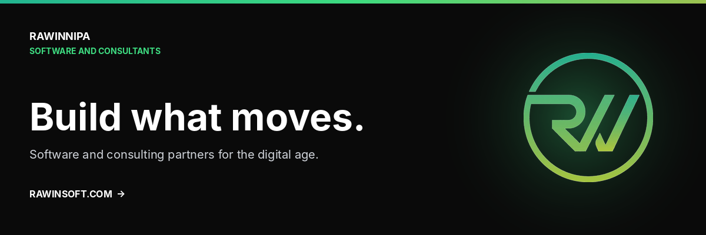 |
| Instagram Square — `1080 × 1080` | 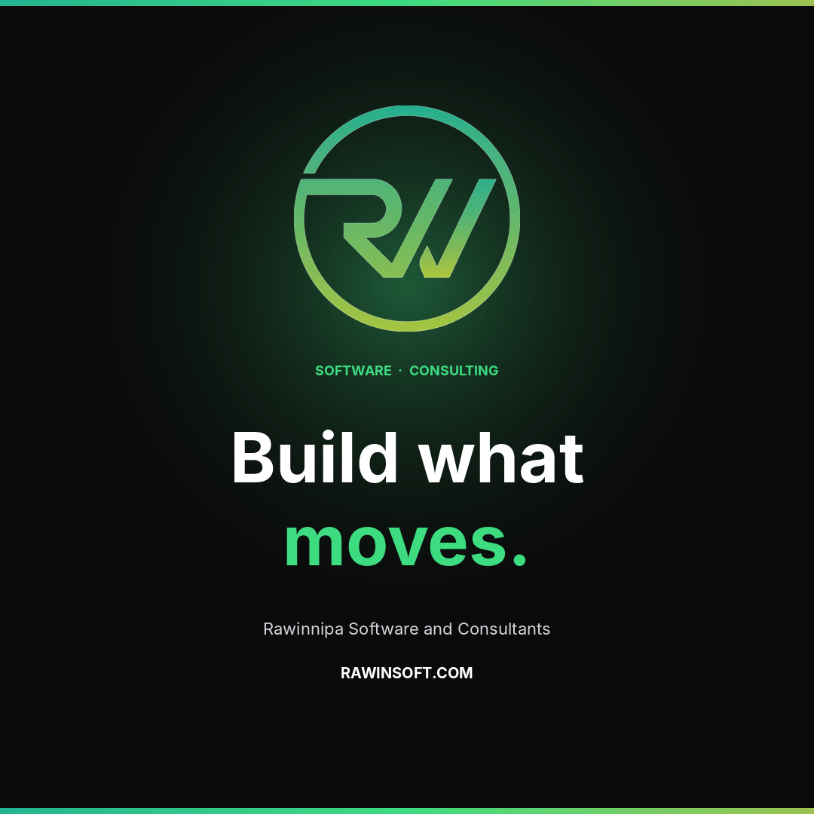 |
| YouTube Channel Art — `2560 × 1440` | 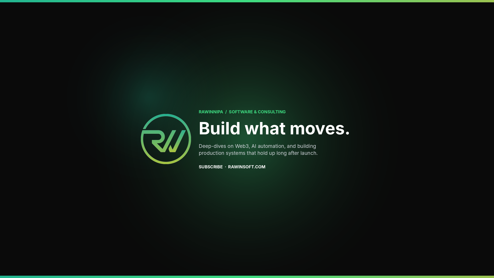 |

> Instagram Story (`1080 × 1920`) — see [`04-key-visuals/kv_instagram_story_1080x1920.png`](04-key-visuals/kv_instagram_story_1080x1920.png).

---

## 📋 Use-case → deliverable

| What you need to do | Use this file |
|---|---|
| Teach a new designer/dev the brand | [`01-strategy/…Brand_Guidelines.pdf`](01-strategy/Rawinnipa_Brand_Guidelines_v1.0.pdf) |
| Drop brand tokens into a codebase | [`01-strategy/…Brand_Guidelines.md`](01-strategy/Rawinnipa_Brand_Guidelines_v1.0.md) §9 |
| Place the logo in a new document | [`02-logo/logo_color.png`](02-logo/logo_color.png) |
| Submit a proposal / RFP | [`03-corporate/…Company_CV.pdf`](03-corporate/Rawinnipa_Company_CV_v1.0.pdf) |
| Full company introduction | [`03-corporate/Rawinnipa_Company_Profile.pdf`](03-corporate/Rawinnipa_Company_Profile.pdf) |
| Update LinkedIn page header | [`04-key-visuals/kv_linkedin_1584x396.png`](04-key-visuals/kv_linkedin_1584x396.png) |
| Post IG announcement | [`04-key-visuals/kv_instagram_square_1080x1080.png`](04-key-visuals/kv_instagram_square_1080x1080.png) |
| Set up YouTube channel | [`04-key-visuals/kv_youtube_2560x1440.png`](04-key-visuals/kv_youtube_2560x1440.png) |
| Pitch deck cover / website hero | [`04-key-visuals/kv_hero_1920x1080.png`](04-key-visuals/kv_hero_1920x1080.png) |
| Thai-audience hero | [`04-key-visuals/kv_hero_thai_1920x1080.png`](04-key-visuals/kv_hero_thai_1920x1080.png) |
| Brief a uniform vendor | [`05-uniforms/Rawinnipa_Uniform_Spec_Sheet_v1.0.pdf`](05-uniforms/Rawinnipa_Uniform_Spec_Sheet_v1.0.pdf) |
| Review uniform design directions | [`05-uniforms/Rawinnipa_Uniform_Design_Deck_v1.0.pdf`](05-uniforms/Rawinnipa_Uniform_Design_Deck_v1.0.pdf) |
| Preview a uniform on a specific color | [`05-uniforms/mockups/`](05-uniforms/mockups/) (polo/tee × 5 colorways × front/back) |
| Start a new slide deck | [`06-templates/Rawinnipa_Slide_Template_v1.0.pptx`](06-templates/Rawinnipa_Slide_Template_v1.0.pptx) |
| Draft a social post (landscape/square/vertical) | [`06-templates/`](06-templates/) — pick the matching orientation |
| Order business cards | [`07-stationery/business_card_front.pdf`](07-stationery/business_card_front.pdf) + [`_back.pdf`](07-stationery/business_card_back.pdf) |
| Print an envelope | [`07-stationery/envelope_dl.pdf`](07-stationery/envelope_dl.pdf) |
| Send a quotation / invoice | [`07-stationery/quotation_A4.docx`](07-stationery/quotation_A4.docx) · [`invoice_A4.docx`](07-stationery/invoice_A4.docx) |
| Write on letterhead | [`07-stationery/letterhead_A4.docx`](07-stationery/letterhead_A4.docx) |
| Pitch merch to a vendor | [`08-merch/merch_lineup.png`](08-merch/merch_lineup.png) |
| Print stickers | [`08-merch/sticker_sheet.pdf`](08-merch/sticker_sheet.pdf) |

---

## ⚙️ Regenerating assets

Every asset in this repo is generated from a script in [`scripts/`](scripts/). Change a tagline, swap a color, add a new format — edit the script and rerun. No manual design edits required.

### Setup

```bash
# For PPTX (Brand Guidelines + Company CV)
npm install -g pptxgenjs react react-dom react-icons sharp

# For PNG key visuals
pip install Pillow numpy
apt install fonts-inter fonts-noto-core   # once per machine
```

### Run

```bash
node scripts/build_brand_ci.js     # regenerates Brand Guidelines PPTX
node scripts/build_brand_cv.js     # regenerates Company CV PPTX
python3 scripts/build_kv.py        # regenerates all key visuals
python3 scripts/build_uniforms.py  # regenerates uniform mockups
```

Each script writes to its source folder — copy outputs back into this repo when satisfied.

---

## 📞 Contact

- **Email** — sayhi@rawinsoft.com
- **Website** — [rawinsoft.com](https://rawinsoft.com)
- **Phone** — +66 98 265 9690

---

## 📦 Versioning

| Component | Version |
|---|---|
| Brand Guidelines      | 1.0   |
| Company CV            | 1.0   |
| Key Visuals           | 1.0   |
| Uniforms              | 1.0   |
| Templates             | 1.0   |
| Stationery            | 1.0   |
| Merch                 | 1.0   |
| Company Profile       | 1.2.4 |

When you update an asset, bump its component version and update the Changelog below.

### Changelog

- **v1.0** (April 2026) — Initial release. Brand Guidelines, Company CV, logo variants, 9 key visuals (incl. Thai), and reproducible source scripts.
- **Uniforms v1.0** (April 2026) — Added `05-uniforms/`: Uniform Design Deck + Spec Sheet (PPTX/PDF/DOCX), and ~168 mockup renders (polo/tee × 5 colorways × front/back/grid) across four layout families (classic, center, center-with-logo, sleeve-logo).
- **Templates v1.0** (April 2026) — Added `06-templates/`: editable Slide Template and Social templates (landscape, square, vertical) as PPTX.
- **Stationery v1.0** (April 2026) — Added `07-stationery/`: business card (front/back + mockup), DL envelope (+ mockup), A4 letterhead, invoice, and quotation (DOCX + PDF).
- **Merch v1.0** (April 2026) — Added `08-merch/`: mockups for cap, mug, notebook, pin, sticker, tote, a merch lineup render, and a print-ready sticker sheet.

---

## 📄 License

© 2026 Rawinnipa Software and Consultants. All brand assets, guidelines, and source files are proprietary. Do not redistribute without permission.
